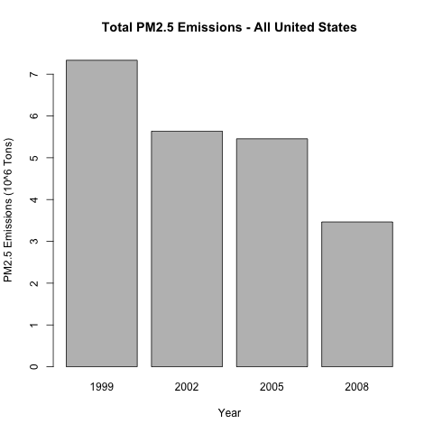
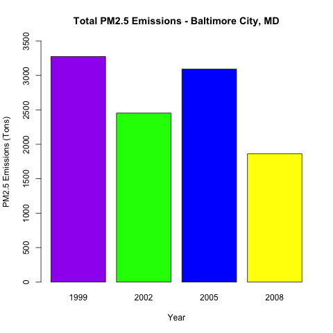
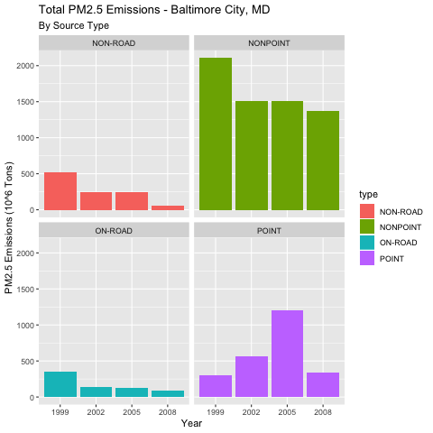
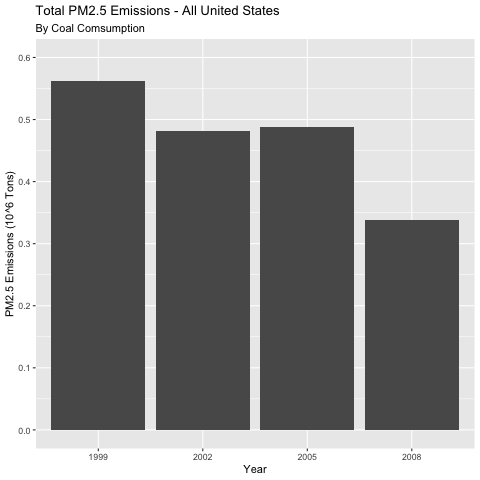
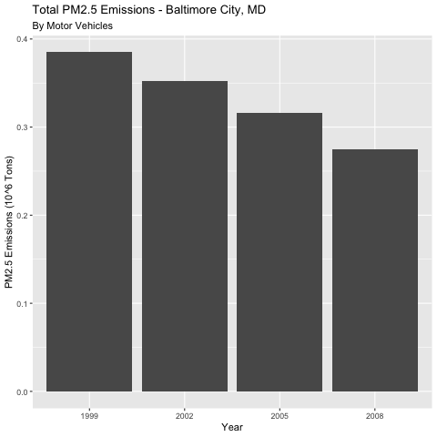
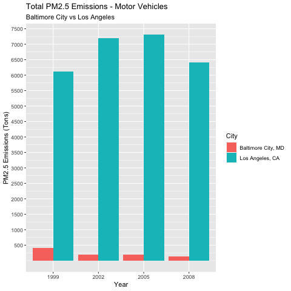

## Analysis of Plots
Vinicio Alvarado
17/9/2020
Analysis of Plots

###**Plot 1**

*Question*: Have total emissions from PM2.5 decreased in the United States from 1999 to 2008? Using the base plotting system, make a plot showing the total PM2.5 emission from all sources for each of the years 1999, 2002, 2005, and 2008.

*Analysis*: The total PM2.5 emissions across the United States has decreased from 1999 to 2008. The total emissions stabilized from 2002 to 2005 but significantly decreased from 2005-2008.

###**Plot 2**

*Question*: Have total emissions from PM2.5 decreased in the Baltimore City, Maryland (fips==”24510”) from 1999 to 2008? Use the base plotting system to make a plot answering this question.

*Analysis*: Ultimately, emissions in Baltimore City, MD have decreased from 1999 to 2008 but it was not a stable decrease in emissions with a spike in 2005.

###**Plot 3**

*Question*: Of the four types of sources indicated by the type (point, nonpoint, onroad, nonroad) variable, which of these four sources have seen decreases in emissions from 1999–2008 for Baltimore City? Which have seen increases in emissions from 1999–2008? Use the ggplot2 plotting system to make a plot answer this question.

*Analysis*: Emissions from on-road, non-point, and on-road sources all significantly decreased from 1999 to 2008. The only source that increased emissions slightly was from the point source.

###**Plot 4**

*Question*: Across the United States, how have emissions from coal combustion-related sources changed from 1999–2008?

*Analysis*: Emissions across the United States related to coal combustion has decreased from 1999 to 2008.

###**Plot 5**

*Question*: How have emissions from motor vehicle sources changed from 1999–2008 in Baltimore City?

*Analysis*: Emissions in Baltimore City, MD related to motor vehicle sources has steadily decreased from 1999 to 2008.

###**Plot 6**

*Question*: Compare emissions from motor vehicle sources in Baltimore City with emissions from motor vehicle sources in Los Angeles County, California (fips==”06037”). Which city has seen greater changes over time in motor vehicle emissions?

*Analysis*: Emissions related to motor vehicle sources in Baltimore City vs Los Angeles has stark differences. Emmissions from Los Angeles heavily over power emissions from Balitimore City. Los Angeles has not decreased motor vehicle emissions at all from 1999 to 2008 while Baltimore City decreased emissions by over half.

